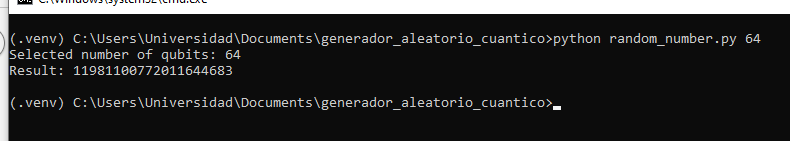
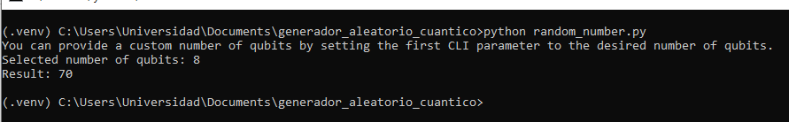

# Generador cuántico de números aleatorios (simulado)

Este proyecto es una demostración de cómo se generan números aleatorios utilizando computación cuántica simulada gracias al framework Qiskit y QiskitAer.

## Ejecución

Desde una terminal ejecutar:

- python random_number.py [número de qubits]

El número de qubits es opcional.

## Screenshots

## Planes a futuro

- Añadir soporte de IBM Quantum.
- Frontend web

## Extras

El proyecto está en inglés con el fin de respetar las buenas prácticas.
